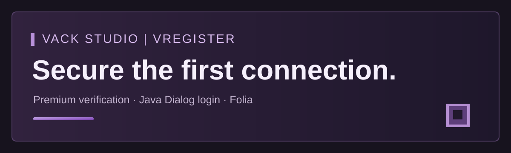

# VRegister

**Commercial plugin by VACK STUDIO.** VRegister manages account registration, BCrypt password hashes, SQLite accounts and login sessions for Folia 1.21.11. It presents native Java Dialogs to supported cracked clients before world entry. Premium ownership verification is delegated to the matching FastLoginPlusFolia bridge; Floodgate Bedrock players bypass VRegister.

The current build targets Java 21 and runs on the project's Java 25 Folia environment. The matching FastLoginPlusFolia bridge build is `0.7.0-vregister.1-2c5808e`. ProtocolLib is required by FastLoginPlusFolia.

## Availability

VRegister is paid software. The source and installable JAR are distributed privately to accounts approved by VACK STUDIO. **This public repository contains no plugin binary or source code.** Contact VACK STUDIO to arrange access and written usage terms.

## Verification status

The 1.0.0 source builds and local unit tests pass. A live end-to-end Folia 1.21.11 connection test with Premium, cracked, legacy and Bedrock clients has not been completed in this workspace.

Copyright © 2026 VACK STUDIO. All rights reserved. See [LICENSE](LICENSE).
